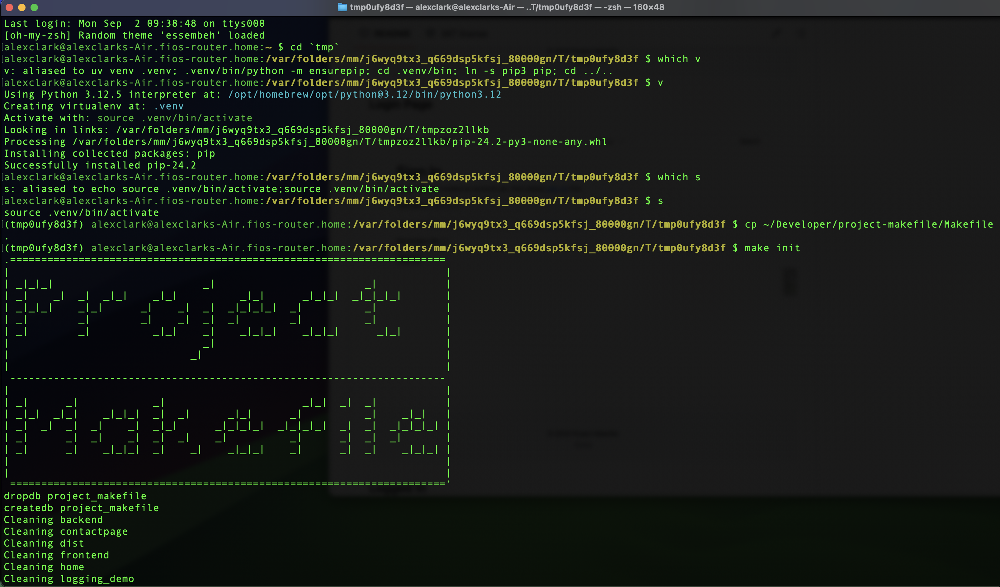
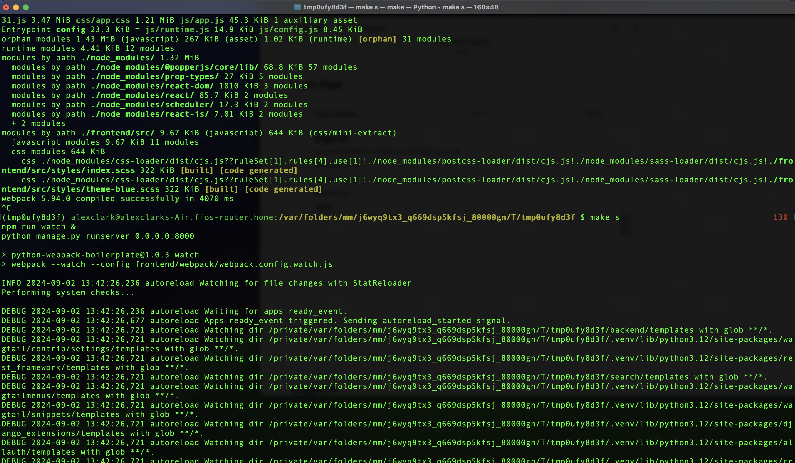
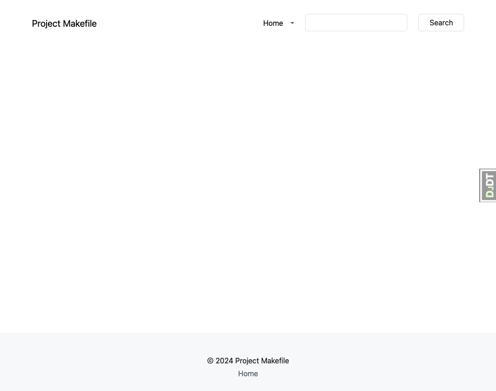
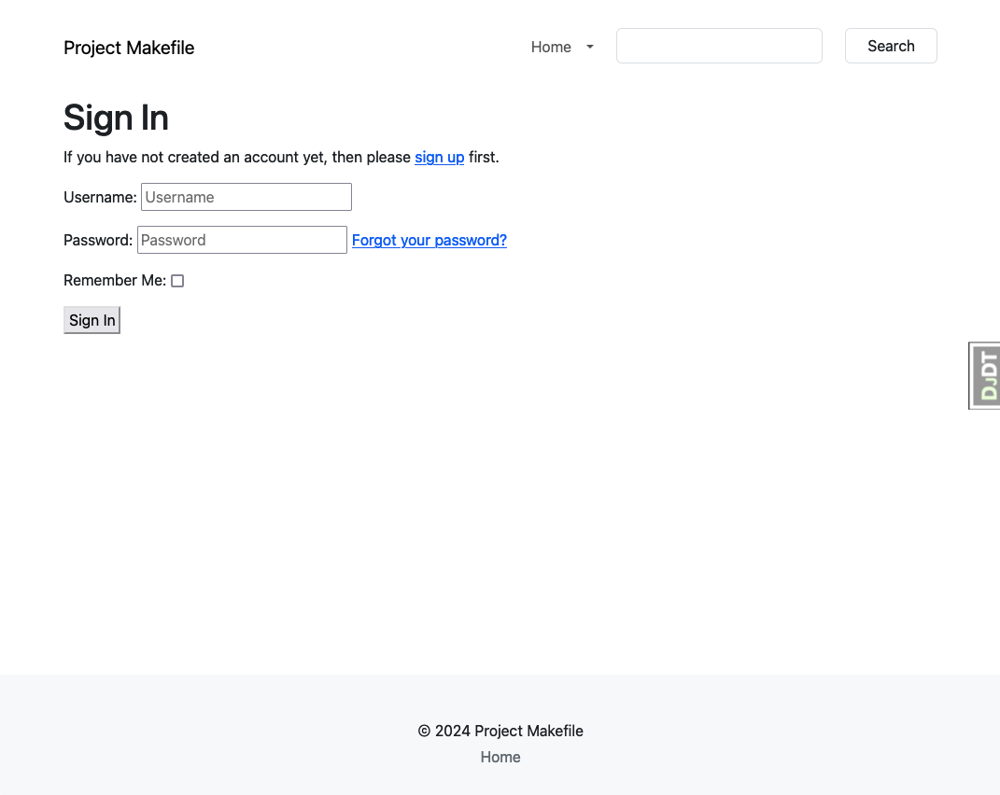
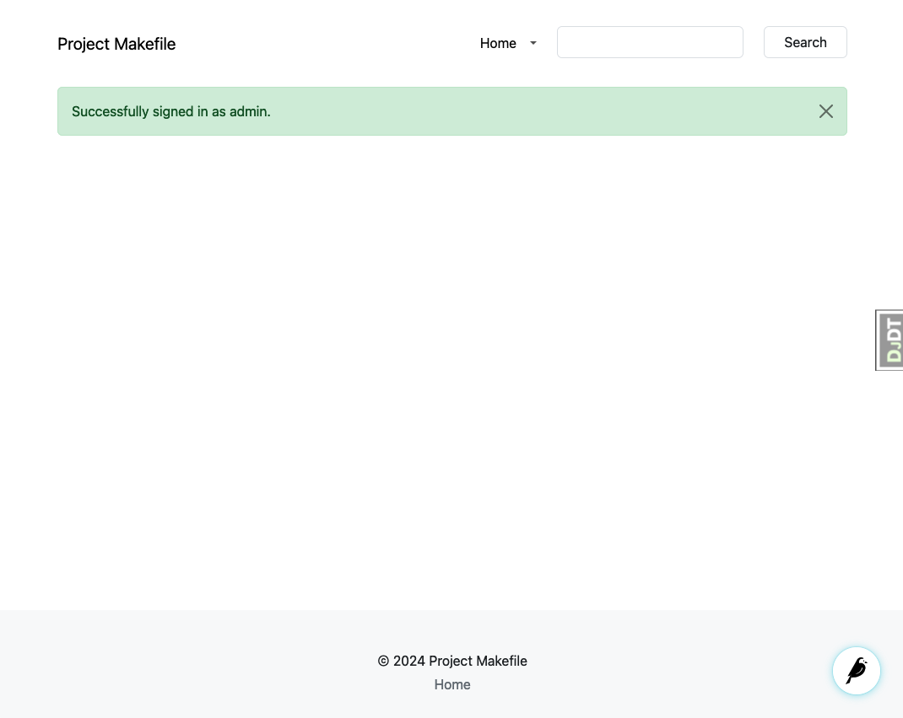
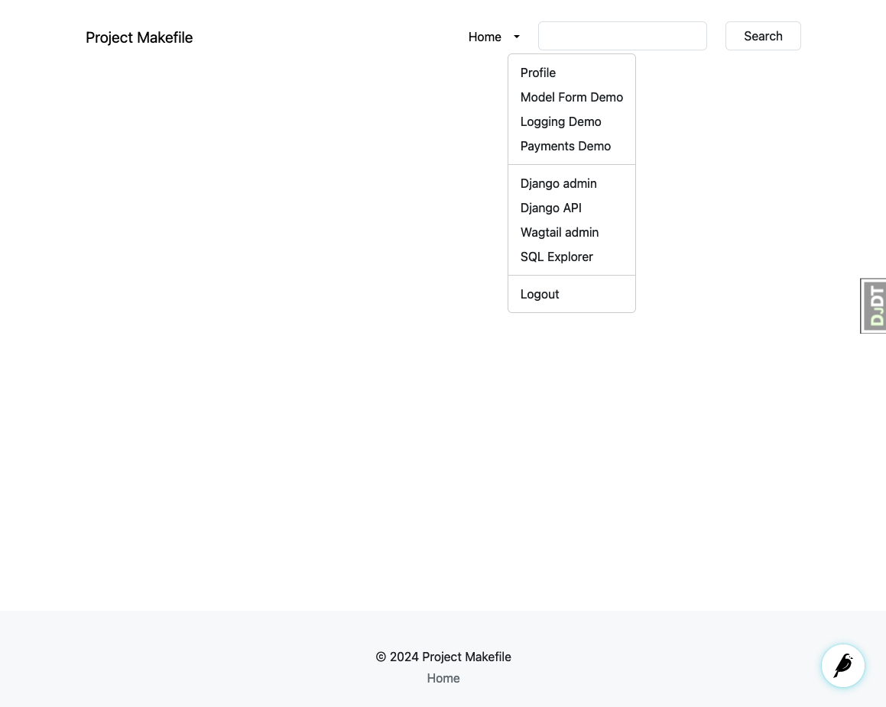

# Project Makefile

[](https://github.com/aclark4life/project-makefile/actions)

> "I like to type make `<target>` to perform tasks. 🤷" —Alex

## Installation

```bash
curl -O https://raw.githubusercontent.com/aclark4life/project-makefile/main/Makefile
```

## Usage

```bash
$ make help
Project Makefile

"I like to type make <target> to perform tasks. 🤷" —Alex

Usage: make <target1> [target2 ...]
Examples:
   make help                   Print this message
   make list-targets           List all targets
   make django-init            Install Django
   make django-init-minimal    Install Django with minimal dependencies
   make django-init-wagtail    Install Wagtail
```

## Customization

```bash
$ make project.mk
$ cat project.mk
# Custom Makefile
# Add your custom makefile commands here
#
# PROJECT_NAME := my-new-project
```

## Screenshots

### Initial Setup




### Home Page


### Login Page


### Logged In


### Dropdown Menu

